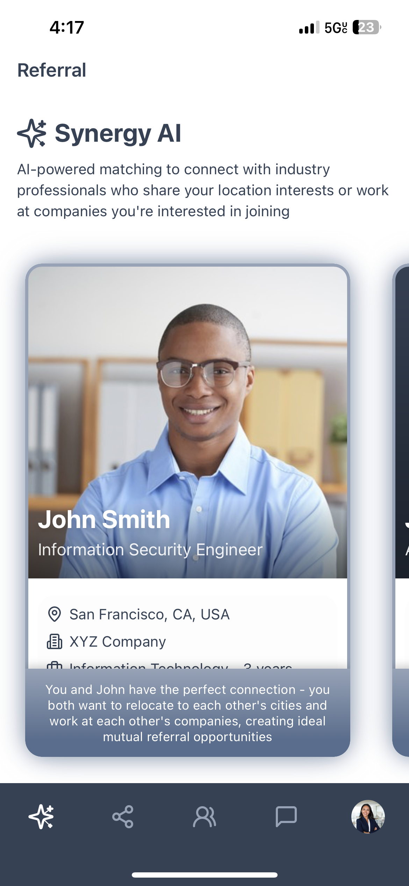
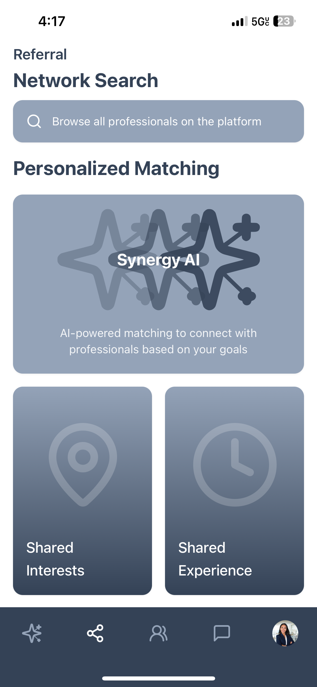
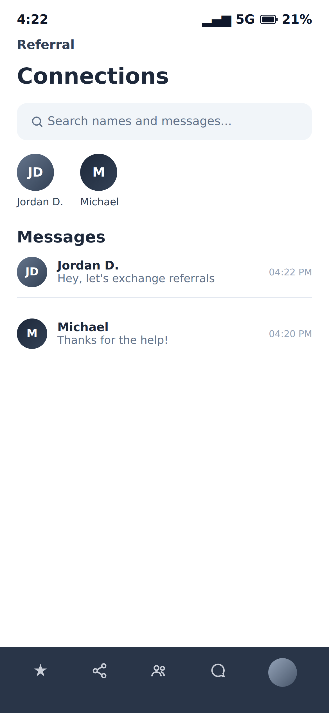

# Referral

**Professional introductions for the jobs you actually want.**

[](https://github.com/kyleshugrue/Referral/actions/workflows/ci.yml)
[](https://referralprofessional.net)

[Referral](https://referralprofessional.net) helps job seekers find relevant
professionals at companies they want to join, start a conversation, and
request a warm referral instead of sending another cold application.

Kyle Shugrue independently built this application with AI-assisted development
tooling. The product decisions, application architecture, security model, and
validation standards remain human-owned and are documented in this repository.

## The problem and the solution

Most job seekers do not have a trusted connection at the company they want to
join, while employees often lack a simple way to discover promising people
they could refer. Referral makes that introduction actionable: users describe
their experience and goals, the platform identifies relevant connections, and
the two people can communicate in one place.

## Core features

- Professional profiles with company, industry, location, experience,
  interests, and resume support
- Deterministic matching based on shared companies, industries, locations,
  experience, and goals
- Human-readable match explanations and a focused referral-request flow
- Connection requests and real-time WebSocket messaging
- Search across professional networks
- Responsive web experience plus a Capacitor iOS client
- Server-rendered guides for discoverability

## How the AI boundary works

The application does not hand matching decisions to an opaque model.
Deterministic application and database logic identifies candidate matches.
Claude generates the natural-language explanation for an identified match
through the separately deployed private Worker. AI does not arbitrarily decide
whether users match.

## Architecture

| Layer | Technology |
| --- | --- |
| Web | React, TypeScript, Vite, TailwindCSS, shadcn/ui, Wouter, TanStack Query |
| Backend | Express, TypeScript, Drizzle ORM, WebSockets |
| Database | PostgreSQL |
| Authentication | Firebase Authentication with server sessions and iOS JWTs |
| Mobile | Capacitor iOS |
| Storage | External object storage for resumes and authenticated local photo uploads |
| Background work | Private Worker for match explanations and push notifications |

The main app owns the user-facing APIs, authentication, profiles, connections,
messaging, uploads, and the PostgreSQL job queues. The private Worker consumes
queued jobs, calls Claude, and sends results back through authenticated
application endpoints. The Worker source and its operational configuration are
intentionally outside this showcase.

## Screenshots

These are genuine Referral application screenshots displayed on the live
marketing site. They show approved demonstration content only; non-visible
image metadata was removed before publication without changing the displayed
pixels.

<p>
  
  
  
</p>

## Local development

Prerequisites are Node.js 24 and PostgreSQL. Copy the placeholder environment
template, supply your own development services, and install the locked
dependency tree:

```bash
npm ci
cp .env.example .env
npm run db:push
npm run dev
```

The combined Express/Vite development server runs on port 5000. Review
database changes before applying them to any shared database.

## Testing and CI

The public CI workflow runs the same application-quality checks that make this
showcase useful to review: repository hygiene, migration validation, linting,
the strict TypeScript gate, unit tests, a production build, bundle-budget
checks, and browser smoke tests. It also validates the export in a disposable
clean room.

The canonical private source is exported through a deterministic allowlist.
The public export is checked for exact file hashes, safe file types, privacy
findings, and runtime equivalence with the canonical production artifact
before publication. This protects the public source boundary without
publishing private export-control policy or operational files.
Every update reaches public `main` only after both private and public CI pass.

## Source boundary and limitations

This repository is a fresh, history-free public subset of the canonical
private application. It contains buildable application source, migrations,
tests, native templates, CI, and approved genuine demonstration assets. It does not contain
credentials, user uploads, production data, private operational controls,
historical Git objects, or the separately deployed Worker implementation.

As with any portfolio showcase, local development requires configuring your
own Firebase and PostgreSQL services. The live application and its production
infrastructure are not reproduced by this repository. See
[`ARCHITECTURE.md`](ARCHITECTURE.md), [`SECURITY.md`](SECURITY.md), and
[`DEVELOPMENT.md`](DEVELOPMENT.md) for the technical and security boundaries.